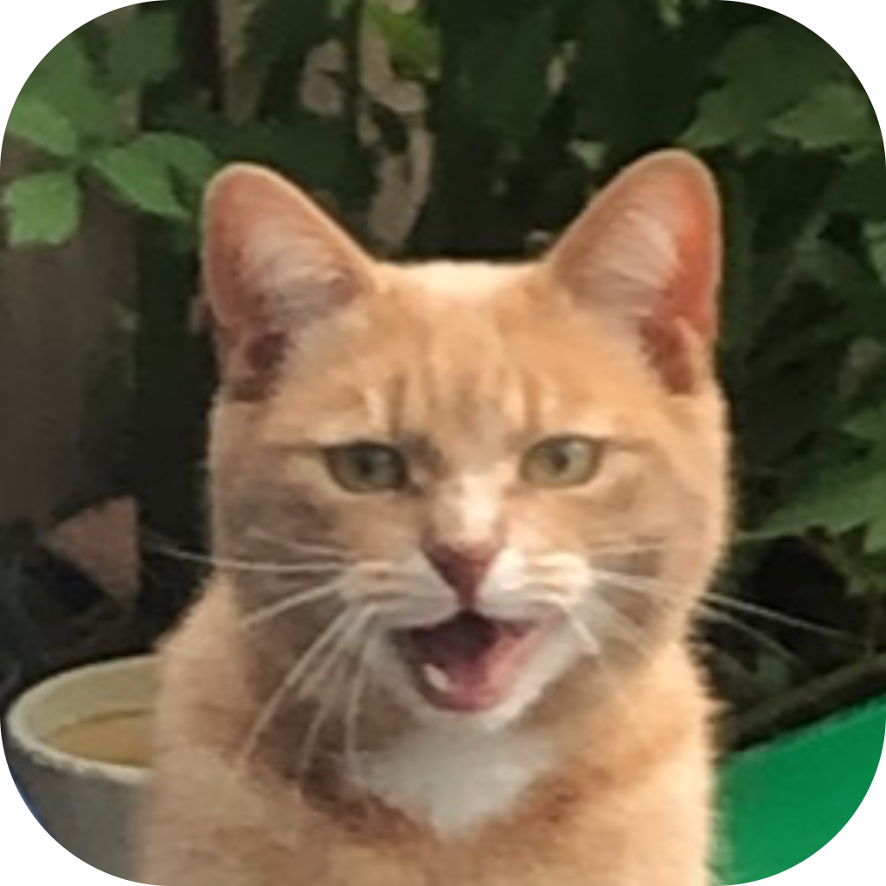

<!-- ## Loulou's App -->

| About        |                 |
|--------------|-----------------|
| **Frontend** | SwiftUI         |
| **Backend**  | Express js      |
| **Database** | Prisma/Postgres |
|[GitHub App](https://github.com/wissehes/loulous-eten-app) | [GitHub Backend](https://github.com/wissehes/LoulouEtenServer/tree/v1) |

[Website](https://loulous-app.wissehes.nl) | [App Store](https://apps.apple.com/nl/app/loulous-app/id1582658466?l=en)

Loulou's App is an app for keeping track of your pet's food. You can create a profile for your pet(s), share it with other people, add a picture, add feeding instructions.

I made this app because me and my family were frequently asking eachother if our cat had already been fed, because he sometimes acts as if he's hungry when he already got his food :)

