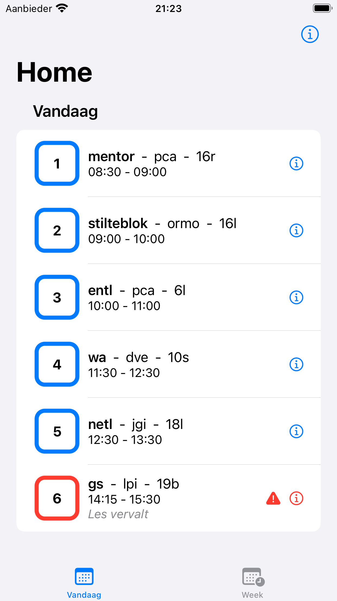
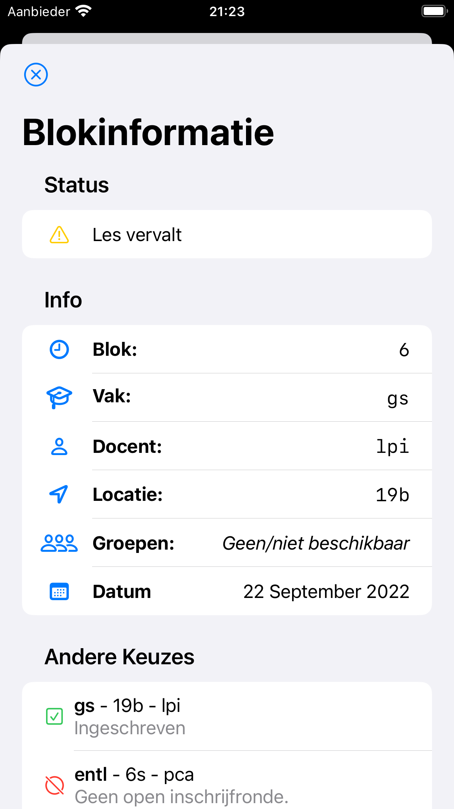
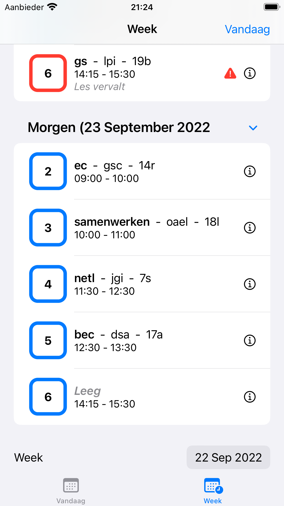

<!-- ## Zermelo App -->

Our school system (zermelo) didn't have an app (only a sluggish web app). So I wanted to see if I could make a proper iOS app for it. I first looked for any documentation on their API, which thankfully existed (unlike with magister...). I saw that their api is very simple to work with.

Mijn school gebruikt Zermelo om keuzeblokken in te vullen en om je rooster te kunnen zien. Zermelo heeft alleen geen native iOS app, dus wilde ik er een maken. Ik keek online even rond om te zien of Zermelo openbare api heeft. Gelukkig hebben zij wel een fatsoenlijke api (kuch kuch... magister).

Daarna probeerde ik eerst een simple [React app](https://github.com/wissehes/zermelo-react-app) te maken om de api eerst uit te testen, met een simpele overzicht van je rooster.

## Screenshots

|   Home  |  Blokinfo  |  Week  |
| :-----: | :--------: | :----: |
|  |  |  |

## Privacy

RoosterApp voor Zermelo verwerkt persoonsgegevens om te kunnen werken. Deze worden echter (naast authenticatie-token en school-domein) niet opgeslagen op uw device. 
Alleen bij Zermelo zelf.

[Zermelo's privacyverklaring](https://www.zermelo.nl/privacyverklaring/)